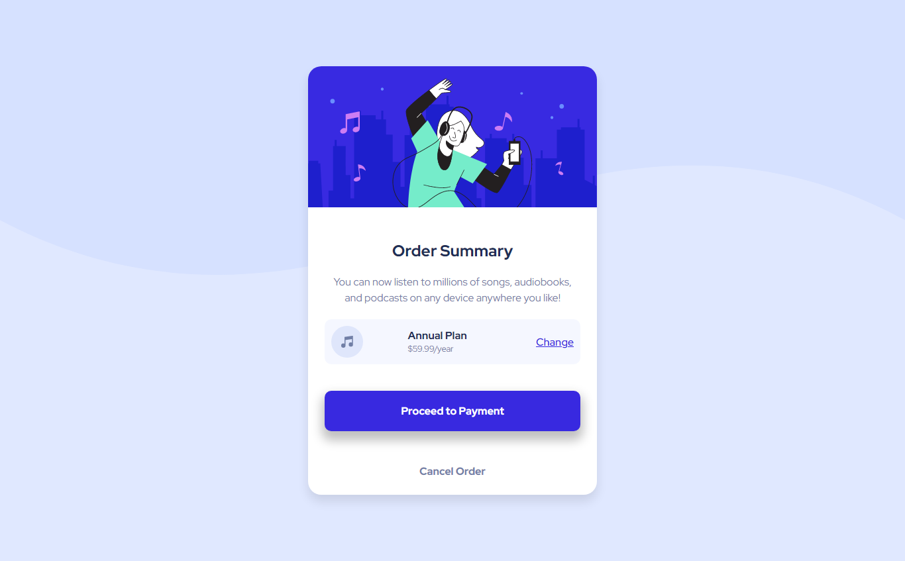

# Order summary card solution

This is a solution to the [Order summary card challenge on Frontend Mentor](https://www.frontendmentor.io/challenges/order-summary-component-QlPmajDUj). Frontend Mentor challenges help you improve your coding skills by building realistic projects. 

## Table of contents

- [Overview](#overview)
  - [The challenge](#the-challenge)
  - [Screenshot](#screenshot)
  - [Links](#links)
- [My process](#my-process)
  - [Built with](#built-with)
- [Author](#author)

## Overview

### The challenge

Users should be able to:

- See hover states for interactive elements

### Screenshot

Desktop View

Mobile View

### Links

- Solution URL: [GitHub Repo](https://github.com/GentryHQ)
- Live Site URL: [GitHub Page](#)

## My process

### Built with

- Semantic HTML5 markup
- CSS custom properties
- Mobile-first workflow

## Author

- Website - [Gentry.com.ng](https://www.gentry.com.ng)
- Frontend Mentor - [@GentryHQ](https://www.frontendmentor.io/profile/GentryHQ)
- Twitter - [@iam_gentry](https://www.twitter.com/iam_gentry)

